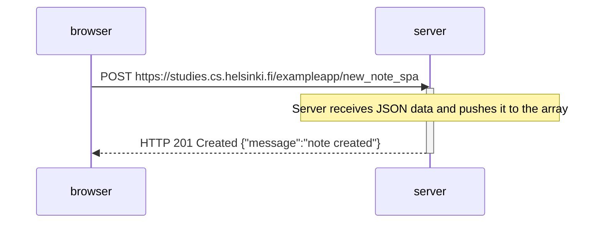

```mermaid
sequenceDiagram
participant browser
participant server

    browser->>server: POST https://studies.cs.helsinki.fi/exampleapp/new_note_spa
    activate server
    Note over server: Server receives JSON data and pushes it to the array
    server-->>browser: HTTP 201 Created {"message":"note created"}
    deactivate server
```
